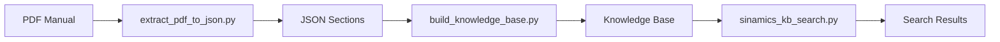

# 🚀 Quick Start Guide - DocKB_Siemens

## Setup Rapido (5 minuti)

### Step 1: Installa Dipendenze Sistema

**Windows (PowerShell come Administrator):**
```powershell
# Opzione A: Chocolatey (consigliato)
choco install poppler pandoc

# Opzione B: scoop
scoop install poppler pandoc
```

**Linux (Ubuntu/Debian):**
```bash
sudo apt-get install poppler-utils pandoc
```

**macOS:**
```bash
brew install poppler pandoc
```

---

### Step 2: Sposta Cartella (Opzionale)

```powershell
# Sposta DocKB_Siemens in c:\Projects
move DocKB_Siemens c:\Projects\

cd c:\Projects\DocKB_Siemens
```

---

### Step 3: Valida Setup

```powershell
python validate_setup.py
```

✅ Tutti i check devono essere **[OK]**

---

## 🎯 Primo Utilizzo

### Estrai un PDF

```powershell
cd scripts

# Estrai PDF SINAMICS
python extract_pdf_to_json.py --pdf ../resources/pdfs/sinamics/manual.pdf --output-dir ../output/sinamics_manual

# O estrai PDF S7-1500
python extract_pdf_to_json.py --pdf ../resources/pdfs/s7_1500/axis_manual.pdf --output-dir ../output/axis_manual
```

**Output:** Migliaia di file JSON (1 per sezione)

---

### Costruisci Knowledge Base

```powershell
python build_knowledge_base.py --input ../output/sinamics_manual --kb-dir ../kb/sinamics/manual
```

**Output:** Knowledge Base indicizzata in `kb/sinamics/manual/`

---

### Cerca nella KB

```powershell
# Cerca fault
python sinamics_kb_search.py --kb ../kb/sinamics/manual --category fault

# Cerca parametri
python sinamics_kb_search.py --kb ../kb/sinamics/manual --category parameter

# Ricerca testuale
python sinamics_kb_search.py --kb ../kb/sinamics/manual --search "p0230"
```

**Output:** Sezioni rilevanti con contenuto

---

## 📊 Workflow Completo



---

## 🔍 Esempi Pratici

### Trovare descrizione allarme

```powershell
cd scripts
python sinamics_kb_search.py --kb ../kb/sinamics --search "A0681"
```

### Estrarre tutti i parametri

```powershell
python sinamics_kb_search.py --kb ../kb/sinamics --category parameter --output ../reports/parameters.json
```

### Generare report fault

```powershell
python extract_alarms_faults.py --kb ../kb/sinamics --output ../data/faults_report.csv
```

---

## 📁 Struttura File

```
DocKB_Siemens/
│
├── resources/pdfs/        ← Metti qui i tuoi PDF
│   ├── sinamics/
│   └── s7_1500/
│
├── kb/                    ← KB generate (auto-create)
│
├── scripts/               ← Script da eseguire
│   ├── extract_pdf_to_json.py
│   ├── build_knowledge_base.py
│   └── sinamics_kb_search.py
│
└── data/                  ← Database estratti
```

---

## ❓ Troubleshooting

### "pdftotext not found"
```powershell
# Installa poppler
choco install poppler

# Verifica
pdftotext -v
```

### "No module named 'config'"
```powershell
# Sei nella directory scripts/, torna a root
cd ..
python validate_setup.py
```

### "Registry file not found"
```powershell
# Rigenera registry
python setup.py
```

---

## 🎓 Next Steps

1. **Leggi README.md** - Documentazione completa
2. **Esplora docs/** - Guide dettagliate
3. **Prova TIA Portal integration** - File SCL in `tia_portal/`

---

**Buon lavoro con DocKB_Siemens!** 🚀
