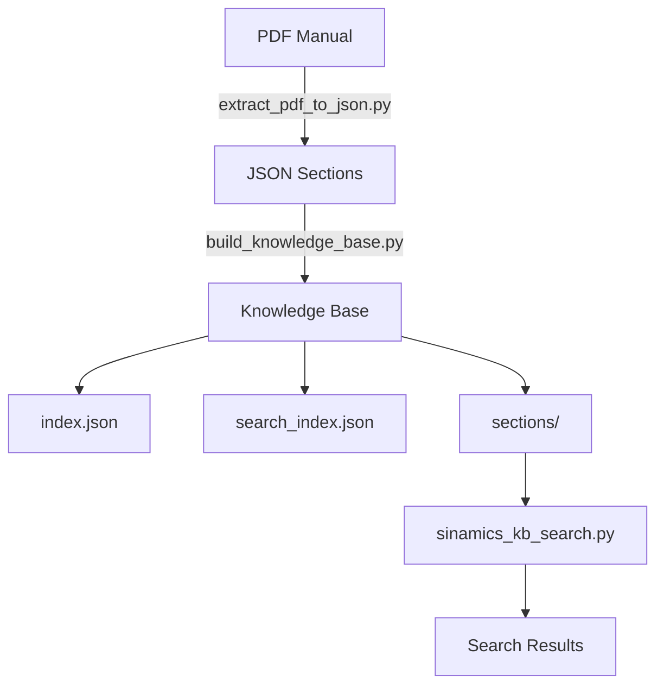

# 📁 Struttura DocKB_Siemens

Documentazione dettagliata della struttura del progetto

---

## 🌳 Directory Tree

```
DocKB_Siemens/
│
├── 📁 resources/                    # File di input
│   └── 📁 pdfs/
│       ├── 📁 sinamics/            # PDF SINAMICS S120/S150
│       └── 📁 s7_1500/             # PDF S7-1500 Motion Control
│
├── 📁 kb/                           # Knowledge Bases generate
│   ├── 📁 sinamics/
│   ├── 📁 s7_1500/
│   └── 📁 unified/                 # KB unificata (tutte le sorgenti)
│
├── 📁 scripts/                      # Script Python
│   ├── extract_pdf_to_json.py      # Step 1: PDF → JSON
│   ├── build_knowledge_base.py     # Step 2: JSON → KB
│   ├── sinamics_kb_search.py       # Step 3: Ricerca KB
│   ├── unified_kb_manager.py       # Gestione KB multiple
│   └── ... (14 script totali)
│
├── 📁 tia_portal/                   # Integrazione TIA Portal
│   ├── SINAMICS_AlarmHandler.scl   # Funzioni SCL per PLC
│   └── Alarms_Faults.scl           # Database allarmi/fault
│
├── 📁 data/                         # Database estratti
│   ├── alarms_faults.json          # 18 allarmi + 14 fault
│   ├── alarms_faults.csv           # Formato Excel
│   ├── mc_functions_list.json      # 111 funzioni MC
│   └── mc_functions_found.json     # Database completo MC
│
├── 📁 docs/                         # Documentazione
│   ├── QUICK_START.md              # Guida rapida 5 min
│   ├── WINDOWS_GUIDE.md            # Guida Windows
│   ├── STRUCTURE.md                # Questo file
│   └── API.md                      # API per sviluppatori
│
├── 📁 output/                       # Output temporanei (gitignored)
├── 📁 temp/                         # File temporanei (gitignored)
│
├── config.py                        # Configurazione percorsi
├── setup.py                         # Setup automatico
├── validate_setup.py                # Validazione
├── requirements.txt                 # Dipendenze
├── kb_registry.json                 # Registry Knowledge Bases
├── .gitignore                       # Git ignore
└── README.md                        # Documentazione principale
```

---

## 📂 Dettaglio Cartelle

### `resources/`

**Scopo:** Input files (PDF manuali tecnici)

**Contenuto:**
- `pdfs/sinamics/` - Manuali SINAMICS S120/S150
- `pdfs/s7_1500/` - Manuali S7-1500 Motion Control

**Utilizzo:** Aggiungi qui i tuoi PDF prima di processarli.

**Gitignored:** ✅ (i PDF non vanno in git)

---

### `kb/`

**Scopo:** Knowledge Bases generate dagli script

**Struttura interna (per ogni KB):**
```
kb/sinamics/manual_name/
├── index.json           # Indice capitoli
├── search_index.json    # Indice categorie ricerca
├── metadata.json        # Metadati globali
└── sections/            # Sezioni arricchite
    ├── sezione_000001.json
    ├── sezione_000002.json
    └── ...
```

**Gitignored:** ✅ (KB sono generate, non versionate)

---

### `scripts/`

**Scopo:** Script Python per processare PDF e gestire KB

**Script Principali:**

| Script | Funzione |
|--------|----------|
| `extract_pdf_to_json.py` | Estrae PDF in JSON |
| `build_knowledge_base.py` | Costruisce KB indicizzata |
| `sinamics_kb_search.py` | Ricerca nella KB |
| `unified_kb_manager.py` | Gestisce KB multiple |
| `extract_alarms_faults.py` | Estrae allarmi/fault |
| `extract_axis_functions.py` | Estrae funzioni MC |

**Gitignored:** ❌ (script vanno versionati)

---

### `tia_portal/`

**Scopo:** File SCL per integrazione con TIA Portal

**File:**
- `SINAMICS_AlarmHandler.scl` - Funzioni lookup allarmi
- `Alarms_Faults.scl` - Database allarmi in SCL

**Utilizzo:**
1. Importa in TIA Portal
2. Usa funzioni nel programma PLC
3. Mostra descrizioni su HMI

**Gitignored:** ❌

---

### `data/`

**Scopo:** Database estratti (JSON/CSV)

**File:**
- `alarms_faults.json` - 18 allarmi + 14 fault SINAMICS
- `alarms_faults.csv` - Stesso contenuto formato Excel
- `mc_functions_list.json` - 111 funzioni Motion Control
- `mc_functions_found.json` - Database completo funzioni MC

**Gitignored:** ❌ (dati curati vanno versionati)

---

### `docs/`

**Scopo:** Documentazione progetto

**File:**
- `QUICK_START.md` - Setup in 5 minuti
- `WINDOWS_GUIDE.md` - Guida Windows completa
- `STRUCTURE.md` - Questo file
- `API.md` - API per sviluppatori

**Gitignored:** ❌

---

### `output/` e `temp/`

**Scopo:** File temporanei durante processing

**Gitignored:** ✅

---

## 🔧 File di Configurazione

### `config.py`

Configurazione centralizzata percorsi cross-platform.

**Contiene:**
- `PROJECT_ROOT` - Root progetto
- `PDF_DIR` - Directory PDF
- `KB_DIR` - Directory KB
- Funzioni helper: `ensure_directories()`, `validate_paths()`

**Esempio uso:**
```python
from config import PDF_DIR, KB_DIR
print(PDF_DIR)  # c:\Projects\DocKB_Siemens\resources\pdfs
```

---

### `kb_registry.json`

Registry di tutte le Knowledge Bases.

**Formato:**
```json
{
  "version": "2.0",
  "knowledge_bases": [
    {
      "id": "sinamics_comm",
      "name": "sinamics_s120_communication",
      "pdf_file": "resources/pdfs/sinamics/manual.pdf",
      "kb_directory": "kb/sinamics/manual",
      "status": "active",
      "language": "en"
    }
  ]
}
```

---

### `setup.py`

Script di setup automatico.

**Funzionalità:**
1. Crea struttura directory
2. Copia PDF dalla cartella originale
3. Copia script Python
4. Copia file dati
5. Genera `kb_registry.json`

**Uso:**
```bash
python setup.py
```

---

### `validate_setup.py`

Script di validazione setup.

**Verifica:**
- Python version >= 3.7
- `pdftotext` e `pandoc` installati
- Struttura directory corretta
- Registry JSON valido
- Percorsi cross-platform

**Uso:**
```bash
python validate_setup.py
```

---

## 📊 Flusso Dati



---

## 🔄 Ciclo di Vita File

1. **Input:** PDF in `resources/pdfs/`
2. **Elaborazione:** Script in `scripts/`
3. **Output Temporaneo:** `output/`
4. **Knowledge Base:** `kb/`
5. **Ricerca:** Via `sinamics_kb_search.py`

---

## 💾 Dimensioni Tipiche

**Esempio: Manuale S7-1500 Axis (3.9 MB PDF)**

```
resources/pdfs/s7_1500/
└── manual.pdf (3.9 MB)

output/manual/
├── documento.json (2.8 MB)
└── sezione_*.json (28,000 files, ~10 MB totale)

kb/s7_1500/manual/
├── index.json (0.5 MB)
├── search_index.json (1 MB)
└── sections/ (28,000 files, ~15 MB totale)
```

**Totale per 1 manual:** ~30 MB

---

## 📁 Best Practices

### Organizzazione PDF

```
resources/pdfs/
├── sinamics/
│   ├── s120_communication_2019.pdf
│   ├── s120_drive_functions_2020.pdf
│   └── s120_list_manual_2020.pdf
└── s7_1500/
    ├── axis_function_it.pdf
    ├── measuring_input_en.pdf
    └── motion_control_overview_en.pdf
```

### Naming Convention

- **PDF:** `product_function_language.pdf`
- **KB:** `kb/product/function/`
- **Output:** `output/product_function/`

---

## 🔍 Come Trovare Cosa

| Cerco | Dove Guardo |
|-------|-------------|
| PDF sorgente | `resources/pdfs/` |
| KB generata | `kb/` |
| Script estrazione | `scripts/extract_pdf_to_json.py` |
| Script ricerca | `scripts/sinamics_kb_search.py` |
| Database allarmi | `data/alarms_faults.json` |
| File SCL | `tia_portal/` |
| Guida rapida | `docs/QUICK_START.md` |
| Configurazione | `config.py` |

---

**Versione:** 2.0  
**Aggiornato:** 2025-12-22
